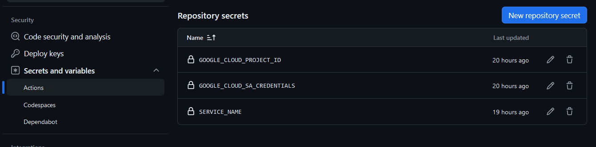

## Конфигурация Google Cloud

Для настройки Google Cloud Run необходимо :

- [Настроить сам Cloud](#настройка-на-стороне-google-cloud)
- [Настроить GitHub репозиторий](#github-conf)

### Настройка на стороне Google Cloud
1. Авторизоваться и создать проект в Google Cloud ([ссылка](https://console.cloud.google.com/projectcreate)):\

2. Перейти в настройки Credentials этого проекта и создать Service Account. 
С этого аккаунта будет происходить push собранного docker image в docker registry самого Google Cloud\

Указываем Service account name и ID, description - опционально, переходим во второй пункт\

Здесь надо дать этому аккаунту роль owner - для полного доступа к Cloud\

Пункт 3 при создании аккаунта можно пропустить.

3. Дальше надо создать ключи авторизации для этого аккаунта. 
Выбираем его в пункте Service Accounts - Keys - Add Key - Create New Key. Тип ключа выбираем JSON\

После создания ключа автоматически должен скачаться json файл, он нам понадобится на следующем этапе.

<h2 id="github-conf">Настройка репозитория GitHub</h2>

После того как вы сделали fork этого репозитория, необходимо перейти на него уже в своём Github и перейти во вкладку Settings
и в ней найти вкладку Secrets and variables - Actions.\

Здесь нам надо создать несколько переменных, к которым мы будем обращаться из наших pipeline'ов.
Нажимаем "create repository secret" и добавляем следующие параметры
- GOOGLE_CLOUD_SA_CREDENTIALS - сюда надо вставить данные из того файла, который скачался при создании ключей доступа для сервис аккаунта. Прямо весь json.
- GOOGLE_CLOUD_PROJECT_ID - идентификатор нашего созданного проекта в GCR. Где его найти видно на скриншоте\
  
(Либо же во вкладке overview)
- SERVICE_NAME - название нашего сервиса, который будет создан в GCR

Всё, проект настроен. Теперь остается зайти во вкладку Actions нашего GitHub репозитория, выбрать workflow "Deploy to Cloud Run" и принудительно его запустить.
Либо же запушить что-то в master-ветку, тогда этот workflow так же будет запущен.

Когда процесс завершится и пайплайн отработает, последним логом будет адрес приложения, которое мы задеплоили в Google Cloud

Либо же мы можем снова открыть Google Cloud Console - Google Cloud Run - и там уже по названию сервиса выбрать наш и посмотреть его адрес

